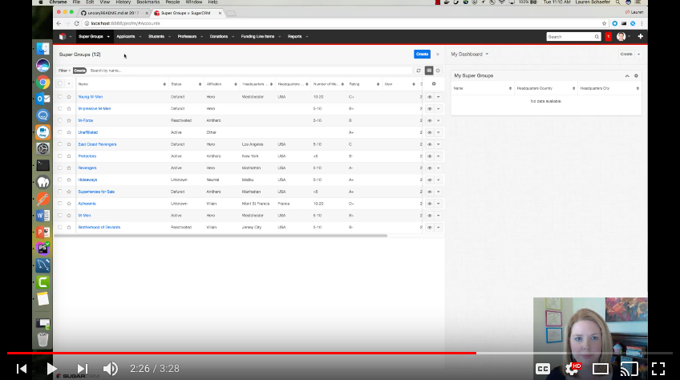
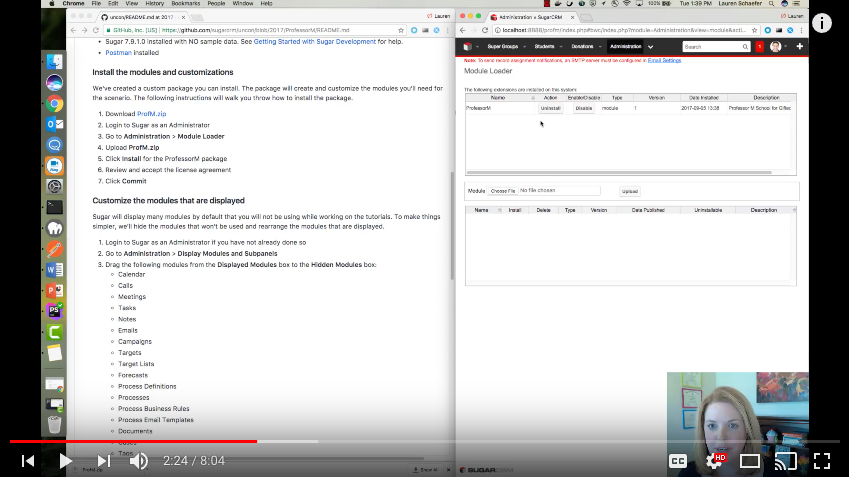

# Professor M's School for Gifted Coders

All of the tutorials at UnCon 2017 will be based on Professor M's School for Gifted Coders.  The following sections will explain more about the scenario and how to install the required modules and sample data.

## About the scenario
Professor M aka Professor Marum has created an exclusive not-for-profit school for gifted coders.  

The school uses Sugar for the following use cases:
- Managing applicants, current students, former students, and professors
- Tracking super groups
- Soliciting donations from alumni and alumni affiliated super groups

For those familiar with Sugar, you'll notice that some of the standard modules have been renamed.

| Professor M Module | Original Sugar Module |
| :--- | :--- |
| Super Groups | Accounts |
| Applicants | Leads |
| Students | Contacts |
| Professors | New custom person-type module |
| Donations | Opportunities |
| Funding Line Items | Revenue Line Items|

Get all of the details on the Professor M scenario in the video below.

## Installation instructions

Before beginning any of the tutorials associated with UnCon 2017, you'll want to setup a Sugar instance that has the Professor M scenario installed.

Watch the video below for instructions on how to install the scenario.  Text-based instructions follow.

### Prerequisites
- Sugar 7.9.1.0 installed with NO sample data.  See [Getting Started with Sugar Development](https://developer.sugarcrm.com/getting-started) for help.
   * Note:  If you install Sugar using ***config_si.php***, ensure that the `disable_unknown_platforms` property is set to `false` or is not in the file.
   * Note for Windows users:  Make the path to your Sugar instance as short as possible to avoid errors of file paths being too long.
- [Postman](https://www.getpostman.com) installed 

### Install the modules and customizations
We've created a custom package you can install.  The package will create and customize the modules you'll need for the scenario.  The following instructions will walk you throw how to install the package.
1. Download [ProfM.zip](/ProfessorM/ProfM.zip)
1. Login to Sugar as an Administrator
1. Go to **Administration** > **Module Loader**
1. Upload **ProfM.zip**
1. Click **Install** for the ProfessorM package
1. Review and accept the license agreement
1. Click **Commit**
   * Hint for Windows users:  If you receive a warning with the message "Full extraction path exceed MAXPATHLEN (260)...", try the following:
     1. Install [ProfM.zip for Windows](/ProfessorM/windows/ProfM.zip).
     1. In your Sugar instance, create the following directories if they do not already exist: [YourSugarDirectory]\custom\modules\Opportunities\clients\base\views\subpanel-for-pmse_bpmprocessdefinition-opportunities_locked_fields_link
     1. Download [subpanel-for-pmse_bpmprocessdefinition-opportunities_locked_fields_link.php](/ProfessorM/windows/subpanel-for-pmse_bpmprocessdefinition-opportunities_locked_fields_link/subpanel-for-pmse_bpmprocessdefinition-opportunities_locked_fields_link.php)
     1. Move the file you just downloaded in the step above to [YourSugarDirectory]\custom\modules\Opportunities\clients\base\views\subpanel-for-pmse_bpmprocessdefinition-opportunities_locked_fields_link
     1. Navigate to **Administration** > **Repair** > **Quick Repair and Rebuild**.
   * If the above installation still fails due to a MAXPATHLEN error, you may need to remove other files with long names from the zip file.
     1. Determine which files are too long.  Hint:  you can see the full paths of the files in the manifest.
     1. Unzip ProfM.zip.
     1. For each file that needs to be removed, remove it from the unzipped copy of ProfM.zip.
     1. For each file that needs to removed, remove the corresponding entry in the manifest, taking note of where the files should be eventually installed (indicated by 'to').
     1. Zip the ProfM directory, ensuring that the manifest is at the root of the zip and is NOT enclosed in another directory.
     1. Install the newly zipped ProfM.zip.
     1. Move the files you removed from the zip to the appropriate locations in your local Sugar directories.
     1. Navigate to **Administration** > **Repair** > **Quick Repair and Rebuild**.
   
   
### Customize the modules that are displayed
Sugar will display many modules by default that you will not be using while working on the tutorials.  To make things simpler, we'll hide the modules that won't be used and rearrange the modules that are displayed.
1. Login to Sugar as an Administrator if you have not already done so
1. Go to **Administration** > **Display Modules and Subpanels**
1. Drag the following modules from the **Displayed Modules** box to the **Hidden Modules** box:
   * Calendar
   * Calls
   * Meetings
   * Tasks
   * Notes
   * Emails
   * Campaigns
   * Targets
   * Target Lists
   * Forecasts
   * Processes
   * Process Business Rules
   * Documents
   * Cases
   * Tags
1. Rearrange the items in the **Displayed Modules** box so they are in the following order from top to bottom:
   * Accounts
   * Leads
   * Contacts
   * Professors
   * Opportunities
   * Revenue Line Items
   * Quotes
   * Reports
   * Process Email Templates
   * Process Definitions
1. Click **Save**

### Use the Sugar REST API to create the Professor M sample data
In order to create the Professor M sample data, you'll use Postman to run a collection of Sugar REST API calls.  Each call in the collection has one or more simple tests associated with it to ensure the call was successful.
1. Save a copy of [ProfessorM_PostmanCollection.json](https://raw.githubusercontent.com/sugarcrm/uncon/2017/ProfessorM/ProfessorM_SampleData/ProfessorM_PostmanCollection.json)
1. In Postman, click **Import**
1. Click **Choose Files** and import **ProfessorM_PostmanCollection.json**
1. Click the gear icon in the upper right corner and select **Manage Enviornments**
1. Click **Add** 
1. Input a name for your environment (for example, **Professor M**)
1. Add the following keys and values:
   * url: the url of your Sugar installation (for example, http://localhost:8888/profm)
   * rest_endpoint:  /rest/v10
   * username:  the username for an admin user in your Sugar installation
   * password:  the password associated with the username above
1. Click **Add**
1. Close the **Manage Environments** dialog
1. Click **Runner**
1. Select the **ProfessorM Sample Data** collection
1. Ensure the environment you just created is selected
1. Click **Run ProfessorM S...**
1. Wait for the collection to finish running. All tests should pass.
   Hint:  If you see many failures, you may have forgotten to install the modules and customizations using ProfM.zip.  See instructions in previous section for how to do the install.

## How to fix your Sugar instance without starting completely over

As you work through the tutorials, you may do something like accidentally write broken code that seems to break your Sugar instance.  Try running **Quick Repair and Rebuild**:
1. Log in as an administrator.
1. Click your profile picture in the upper-right corner and select **Administration**.
1. In the **System** section, click **Repair**.
1. Click **Quick Repair and Rebuild**.

If you become unable to login to your Sugar instance or running **Quick Repair** does not work, try the following:

1. Remove the custom code that is causing problems.
1. Delete the contents of the `cache` directory.
1. Use a program like MySQL Workbench to truncate the `metadata_cache` table.
1. Access your Sugar instance in a browser. If you still receive an error, reload the page.

If the above steps do not fix your problem, you may need to start over.  Delete your Sugar root directory and follow the steps in the Installation Instructions above.
